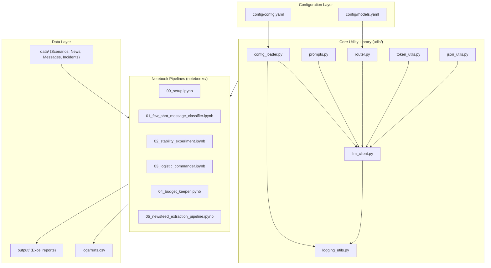
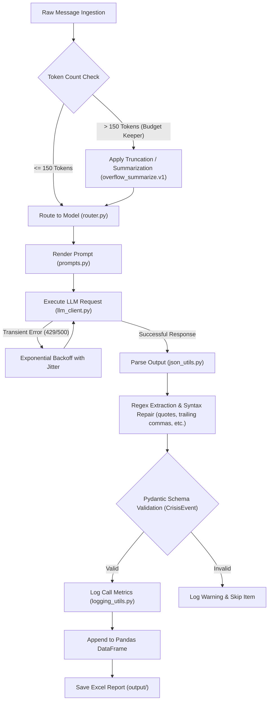

# Operation Ditwah: Crisis Intelligence Pipeline

[](https://www.python.org/)
[](https://github.com/astral-sh/uv)
[](https://docs.pydantic.dev/)
[](https://pandas.pydata.org/)
[](https://openai.com/)
[](https://ai.google.dev/)
[](https://groq.com/)
[](https://github.com/openai/tiktoken)
[](https://jupyter.org/)

Operation Ditwah is a structured crisis intelligence pipeline developed for post-cyclone relief efforts in Sri Lanka. It ingests unstructured text feeds (SOS messages, news updates, and incident reports), classifies intent and priority, validates payloads against strict JSON schemas, executes multi-criteria logistical routing, and compiles validated outputs into tabular reports for dispatch coordination.

---

## System Architecture

The codebase separates configuration, reusable utility classes, and execution pipelines.



---

## Data Pipeline Flow

Individual text inputs pass through validation boundaries, routing tables, API calls, parsing/repair algorithms, and schema tests before export.



---

## Core Utility Modules

### 1. Configuration Management (`utils/config_loader.py`)
- Dynamic setting access using dot-notation paths (e.g., `config.get("retry.max_retries")`).
- Reads parameters from `config/config.yaml` (temperatures, token caps, logging configurations, retry parameters) and provides defaults.
- Loads model mapping references from `config/models.yaml`.

### 2. Unified Client API (`utils/llm_client.py`)
- Standardizes interaction wrappers for OpenAI, Google GenAI SDK, and Groq endpoints.
- Implements exponential backoff with randomized jitter for transient failure recovery (429 rate limits, 5xx server exceptions, request timeouts).
- Dynamically shifts parameters based on model class features (e.g. swaps `max_tokens` for `max_completion_tokens` when invoking OpenAI reasoning engines).
- Integrates structured parsing interfaces and fallback paths for environments that do not support native JSON modes.

### 3. Token Boundary Safeguards (`utils/token_utils.py`)
- Estimates system message, prompt, and context token lengths using `tiktoken`.
- Matches model types to their native tokenizer encodings (`o200k_base` and `cl100k_base`).
- Implements `fit_within_context` to prevent context-window overflows by executing prompt-truncation policies or delegating summarization triggers.

### 4. JSON Extraction and Auto-Repair (`utils/json_utils.py`)
- Extracts JSON objects out of text response payloads using regular expressions.
- Repairs syntactic structural errors (e.g., single quotes, trailing commas, unquoted keys, inline code comments, markdown formatting).
- Bridges standard strings to Pydantic models with automated schema generator templates for LLM injection.

### 5. Telemetry Logger (`utils/logging_utils.py`)
- Tracks latency, API providers, specific model releases, retry attempts, context sizes, and token structures (estimated vs. actual counts).
- Computes estimated execution costs (USD) using static rate maps.
- Logs tabular transaction data automatically to `logs/runs.csv`.

### 6. Prompt Catalog Registry (`utils/prompts.py`)
- Serves as the single repository for prompt definitions using native Python `Template` interpolation.
- Enforces boundaries by defining metadata schemas (stop tokens, task temperatures, default output limits) for specific techniques.
- Preconfigured prompts include:
  - `few_shot.v1`: Enforces multi-class examples with output formats.
  - `cot_reasoning.v1` & `tot_reasoning.v1`: Implements step-by-step reasoning structures.
  - `json_extract.v1`: Restricts responses to schema-matching structures.
  - `overflow_summarize.v1`: Truncates inputs to meet token constraints.

### 7. Dynamic Router (`utils/router.py`)
- Traverses `config/models.yaml` rules to select the appropriate model execution tier.
- Maps general tasks to lower-cost commodity endpoints and routes complex tasks (CoT/ToT structures) to dedicated reasoning models (e.g. `o3-mini`, `gemini-2.0-flash-thinking-exp`).

---

## Execution Notebooks

### `00_setup.ipynb` (Setup & Verification)
Imports package classes, verifies the presence of required API keys inside the environmental variables, and tests basic connections to the primary LLM backends.

### `01_few_shot_message_classifier.ipynb` (Few-Shot SOS Classification)
- **Input**: `data/Sample Messages.txt` (50 unstructured incoming updates).
- **Processing**: Refactors raw text into classified variables using `few_shot.v1` with 5 hand-crafted examples.
- **Contract**: Parses outputs into the format: `District: [Name] | Intent: [Rescue/Supply/Info/Other] | Priority: [High/Low]`.
- **Output**: Writes result set to `output/classified_messages.xlsx`.

### `02_stability_experiment.ipynb` (Deterministic Stress Testing)
- **Input**: `data/Scenarios.txt` (Ambiguous multi-hazard reports).
- **Processing**: Evaluates CoT reasoning paths comparing **Safe Mode** (temperature = 0.0, 1 run) against **Chaos Mode** (temperature = 1.0, 3 runs).
- **Findings**: Safe mode guarantees deterministic risk classifications. Chaos mode exhibits semantic drift, altering risk rankings (e.g., drifting from "High" to "Critical") and introducing non-requested priorities (e.g., road clearing operations).

### `03_logistic_commander.ipynb` (Logistics Routing & Scoring)
- **Input**: `data/Incidents.txt` (3 active dispatch reports).
- **Step A (CoT Priority Scoring)**: Computes priority scores using a rule-based scoring function (Base score of 5; +2 for ages > 60 or < 5; +3 for immediate rescue needs; +1 for medical emergencies).
- **Step B (ToT Strategy Execution)**: Explores 3 paths for a rescue boat stationed at Ragama:
  - *Branch 1*: Highest Priority First (Greedy) -> `Ragama -> Ja-Ela -> Gampaha` (Score: 21, Time: 50m).
  - *Branch 2*: Closest First (Speed) -> `Ragama -> Ja-Ela -> Gampaha` (Score: 21, Time: 50m).
  - *Branch 3*: Furthest First (Logistics) -> `Ragama -> Gampaha -> Ja-Ela` (Score: 21, Time: 90m).
- **Result**: Proves Greedy/Closest routing is optimal, minimizing transit duration.

### `04_budget_keeper.ipynb` (Token Economic Guards)
- **Input**: Simulated user messages, including highly detailed emergency reports and promotional chain-spam.
- **Processing**: Checks token lengths against a 150-token limit. Valid emergency messages are summarized to fit the limit using `overflow_summarize.v1`. Chain-spam messages are identified and flagged as `BLOCKED/TRUNCATED`.

### `05_newsfeed_extraction_pipeline.ipynb` (Structured Extraction Pipeline)
- **Input**: `data/News Feed.txt` (30 lines of news notifications).
- **Processing**: Extracts structured JSON using the `json_extract.v1` prompt template. Passes variables to a Pydantic validation schema (`CrisisEvent`) checking fields:
  - `district` (valid Sri Lankan administrative regions)
  - `flood_level_meters` (float or null)
  - `victim_count` (non-negative integer)
  - `main_need` (non-empty string)
  - `status` (Critical, Warning, or Stable)
- **Output**: Exports all valid records to `output/flood_report.xlsx`.

---

## Installation & Setup

### Prerequisites
- Python 3.11+
- [uv](https://github.com/astral-sh/uv) (recommended) or `pip`

### 1. Initialize Environment
Install all dependencies using the virtual environment configuration:
```bash
# Using uv (fast setup)
uv sync

# Or using standard pip
pip install -r requirements.txt
```

### 2. Configure Environment Variables
Create a `.env` file in the project root:
```env
OPENAI_API_KEY="your-openai-api-key"
GEMINI_API_KEY="your-gemini-api-key"
GROQ_API_KEY="your-groq-api-key"
```

### 3. Execution
Launch Jupyter Lab to run the pipelines:
```bash
# Using uv
uv run jupyter lab

# Or using standard python
jupyter lab
```
